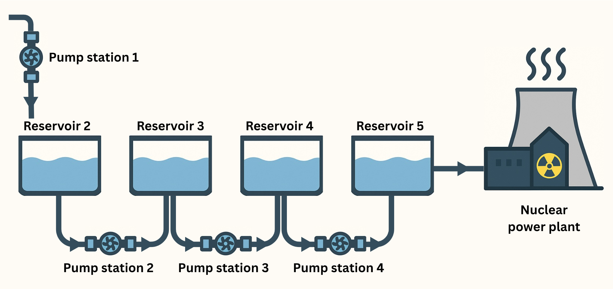

# `hydro_control_rl_optimiser`

A reinforcement-learning–based controller for a **multi-stage water pumping network**, designed to maintain reservoir stability, meet variable demand, and minimise operational stress and energy usage.

<p align="center">

</p>

Author: Alessandro Tomassini <alessandro.tomasini@gmail.com>
---

## 🚀 Quick Start

### 1. Install Python

Ensure you have **Python 3.12** installed.

```bash
python --version
# should output: Python 3.12.x
```

---

### 2. Clone the repository

```bash
git clone https://github.com/ale-tom/hydro_control_rl_optimiser.git
cd hydro_control_rl_optimiser
```

---

### 3. Set up the environment

This project uses [**Poetry**](https://python-poetry.org/) for dependency and environment management.

If Poetry is not installed:

```bash
pip install poetry
```

Then install all dependencies (including development tools for testing and linting):

```bash
poetry install --with dev
```

---

### 4. Run the analysis notebook

Launch Jupyter Lab or Notebook:

```bash
poetry run jupyter lab
```

Open:

```
notebooks/rl_vs_heuristic_control_analysis.ipynb
```

---

### 5. (Optional) Run tests

```bash
poetry run pytest -v
```

## 🌊 Project Overview

This project implements a **prototype control system** for an industrial-scale water distribution network — for example, a multi-stage pumping circuit supplying cooling water to a power or processing facility.

The system consists of several pumping stations and intermediate reservoirs connected in series.
The control objective is to determine, at each minute, how many pumps to activate at each station so that:

* The downstream **demand for water** is satisfied,
* **Reservoir levels** remain within safe operational limits (30–90 % capacity),
* The total number of **pump switching events** (on/off cycles) is minimised, and
* **Energy consumption** is reduced.

The project explores both **heuristic** and **reinforcement learning (RL)** control strategies, implemented in a modular simulation environment.

---

## 🧩 Key Components

| Module                                  | Description                                                                                                        |
| --------------------------------------- | ------------------------------------------------------------------------------------------------------------------ |
| `CoolingLoopSimulator`                  | Simulates hydraulic dynamics of the network (reservoir volumes, flow balances, and pump effects).                  |
| `FullStateDiscretiser`                  | Converts continuous reservoir levels and demand into discrete RL state indices using mixed-radix encoding.         |
| `FullQLearningAgent`                    | Tabular Q-learning agent that jointly controls all pump stations. Supports ε-greedy exploration and value updates. |
| `safe_apply_action`                     | A **safety layer** that prevents the agent from taking actions leading to reservoir underflow or overflow.         |
| `full_run_episode` / `full_train_agent` | Training routines with reward shaping to penalise unmet demand, level violations, switching, and energy use.       |
| `full_evaluate_agent_masked`            | Greedy policy evaluation with a one-step safety mask and unmet-demand tracking.                                    |
| `heuristic_controller_safe`             | Baseline controller using proportional level-tracking logic and a safety mask.                                     |
| `run_nested_eval_with_sklearn`          | Nested cross-validation framework using chronological splits and lexicographic cost comparison.                    |

---

## ⚙️ Reinforcement Learning Setup

* **Algorithm:** Tabular **Q-Learning**
* **State:** Discretised reservoir levels + discrete demand index
* **Action:** Vector of active pump counts across all stations
* **Reward:**
  [
  r_t = -(\text{unmet demand}) - \text{switching penalty} - \text{energy penalty} - \text{level deviation} - \text{violation penalty}
  ]
* **Safety Layer:** Rejects or adjusts unsafe actions to keep training stable.
* **Exploration:** ε-greedy with decaying ε.
* **Training buffer:** Training used stricter safety bounds (0.32–0.88) so that evaluation under true limits (0.30–0.90) yields no violations.

---

## 🧠 Methodological Highlights

* **Safety-aware RL:** The agent never explores actions leading to unsafe transitions, improving sample efficiency and real-world plausibility.
* **Reward shaping:** Carefully balances multiple operational goals.
* **Time-series nested CV:** Robust model selection across demand segments, with optional gap handling to mitigate autocorrelation leakage.
* **Heuristic baseline:** Deterministic proportional controller for interpretability and benchmarking.

---

## 📊 Evaluation Metrics

| Metric           | Meaning                                                         |
| ---------------- | --------------------------------------------------------------- |
| **Violations**   | Steps where any reservoir exceeds bounds.                       |
| **Unmet demand** | Fraction of time or volume shortfall relative to target demand. |
| **Switches**     | Total per-station pump on/off transitions.                      |
| **Energy**       | Cumulative energy consumed (kWh).                               |

A **lexicographic cost** function ranks controllers as:
violations → unmet demand → switches → energy.

---

## 🔬 Results Summary

Both the **RL** and **Heuristic** models successfully maintained all reservoir levels within **30 % – 90 %** of capacity and met downstream water demand.
The key difference lies in the trade-off between **energy consumption** and **switching frequency**.

### ⚡ Energy

* The **RL policy consistently used less energy** than the Heuristic controller across all five test folds.
* Per-fold energy difference (ΔE = RL − Heuristic):
  `[-6788, −12054, −10038, −7423, −7311] kWh`
* Mean = **−8723 kWh (≈ −0.92 %)**, SD ≈ 2250 kWh.
* Sign test: 5 / 5 wins, one-sided *p* ≈ 0.031 (α = 0.05).

### 🔁 Switching

* The **RL policy required more frequent pump switching** in all five folds.
* Per-fold switching difference (ΔS = RL − Heuristic):
  `[+2143, +1885, +463, +4870, +580]`
* Mean = **+1988 switches**, SD ≈ 1778.
* Over a 48-hour test window:

  * RL ≈ 44 switches/hour (all stations combined)
  * Heuristic ≈ 2.5 switches/hour
  * ⇒ RL causes ~17× more switching activity.

### ⚖️ Interpretation

The choice between controllers depends on the **relative economic cost** of energy vs. switching wear.

Let

* *p* = energy price (currency / kWh)
* *c* = effective cost per switch (maintenance + wear + operational).

At the **break-even point**, extra switching cost offsets the RL energy savings:

[
8723,p = 1988,c \quad \Rightarrow \quad c = \frac{8723,p}{1988}.
]

Thus:

* If **real switch cost > c**, the **Heuristic** controller is more economical.
* If **real switch cost < c**, the **RL** controller’s energy savings justify its higher switching rate.

---

## 🧾 Summary & Conclusions

* Both controllers satisfy all operational constraints and deliver the required demand.
* **RL controller:** lower energy use (≈ 0.9 % saving), but much higher switching rate.
* **Heuristic controller:** smoother operation with minimal switching, but slightly higher energy consumption.
* The **optimal choice** depends on the ratio between energy price and per-switch cost.
* The project demonstrates how **reinforcement learning with safety constraints** can match human-designed control performance while enabling quantitative trade-off analysis between maintenance and energy efficiency.

---

## 🧰 Technology Stack

Python 3.12 · NumPy · Pandas · scikit-learn · joblib · matplotlib · seaborn 

RL core: custom Q-learning + safety layer

Testing: `pytest`

---

## 🔒 Disclaimer

This project is a **synthetic, re-contextualised** version of an industrial control prototype.
All data and system parameters are simulated for demonstration purposes.
No proprietary or client-specific information is included.

---

